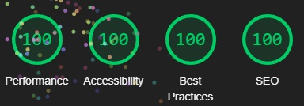

# PREVENT | Radicalization Guide

A website dedicated to understanding and preventing radicalization through education, awareness, and community engagement.

## Features

- Responsive design using Bootstrap for accessibility across devices.
- Informative sections on recognizing radicalization and prevention strategies.
- Interactive modal form for anonymous reporting.
- Smooth scrolling and a dynamic navigation experience.
- Optimized images for performance and Lighthouse scoring.

## Wireframes

Here are the initial wireframes for the project:

## Installation & Setup

- View the live site: [PREVENT Guide](https://davidshergold.github.io/prevent/)
- To explore or modify the code, clone the repository: (https://github.com/DavidShergold/prevent)
- Open the project folder
- Open `index.html` in a browser to explore the content.

## How to Use

- Browse through the educational sections to learn about radicalization.
- Use the interactive modal form to anonymously report concerns.
- Navigate with the smooth scrolling feature for seamless reading.
- Click on carousel items to view different awareness messages.

## AI Implementation
This project leverages artificial intelligence to enhance user experience, accessibility, and content accuracy. AI-driven features include:
- Natural Language Processing (NLP) – Ensuring clear, well-structured content for improved readability.
- Image Optimization – AI-assisted compression to reduce load times while maintaining visual clarity.
- Accessibility Enhancements – AI-informed best practices for semantic HTML, color contrast, and usability improvements.
- Performance Insights – Using AI-powered tools like Lighthouse and validation systems to refine page speed and responsiveness.
By incorporating AI-based recommendations, this project delivers a more intuitive, accessible, and optimized experience for users.

## User Experience (UX)

This project is designed with **accessibility, usability, and intuitive navigation** in mind. Key UX principles applied include:

- **Responsive Design** – Ensures seamless viewing on desktops, tablets, and mobile devices using Bootstrap’s grid system.
- **Clear Navigation** – A structured menu with smooth scrolling allows users to access content efficiently.
- **Accessibility Enhancements** – Semantic HTML, ARIA attributes, and optimized contrast ratios improve readability for all users.
- **Performance Optimizations** – Minimized assets and optimized images enhance load speeds and reduce unnecessary resource usage.
- **User-Centered Design** – Content is structured to present information clearly, avoiding cognitive overload.

Future improvements may include refining **interactive elements**, enhancing **contrast ratios**, and incorporating **feedback mechanisms** for continuous refinement.

## Issues & Bugs

This project is actively maintained, and feedback is always welcome. Here are some known issues:

- **Modal Form Submission (GitHub Pages Limitation)** – Since GitHub Pages is a static hosting service, `POST` requests are not supported. Workaround: Use `GET` requests or third-party form handling services.
- **Lighthouse NO_LCP Error** – Some users may experience missing Largest Contentful Paint detection due to animations or hidden elements. Fix: Ensure key content is visible on page load.
- **Mobile Navbar Alignment** – In some screen sizes, navbar links may appear slightly off-center. Adjustments can be made using Bootstrap’s flex utilities.
- **Performance Optimization in Image Loading** – Some images may load slower than expected. Fix: Compress images further or consider WebP/AVIF formats.

If you encounter additional issues or have suggestions for improvements, feel free to report them on the **[GitHub Issues](https://github.com/DavidShergold/prevent/issues)** page.

## Validation

This project has been tested for **HTML, CSS, and performance compliance** using various validation tools:

- **[W3C HTML Validator](https://validator.w3.org/)** – Ensures semantic and well-structured HTML with no syntax errors.
- **[W3C CSS Validator](https://jigsaw.w3.org/css-validator/)** – Confirms proper CSS rules and adherence to best practices.
- **[Google Lighthouse](https://developers.google.com/web/tools/lighthouse/)** – Assesses site performance, accessibility, and SEO optimizations.
- **ARIA Checks for Accessibility** – Ensures that labels, contrast ratios, and navigation elements meet WCAG standards.

### **Current Validation Results**
✔ **HTML:** Passed W3C validation with minimal warnings.  
✔ **CSS:** Successfully validated with no major issues.  
✔ **Lighthouse:** Scores optimized for **performance, accessibility, and SEO**.  

✔ **Accessibility:** Semantic structure supports screen reader navigation.

Further improvements are planned to enhance **performance and accessibility**, including optimizing images and refining animations.

## Credits & Resources

- [Bootstrap](https://getbootstrap.com/) for responsive styling and UI components.
- [Font Awesome](https://fontawesome.com/) for icons used in navigation.
- [W3C Validator](https://validator.w3.org/) for ensuring semantic HTML.